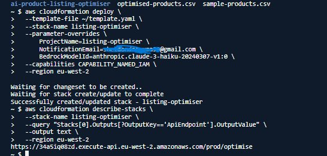
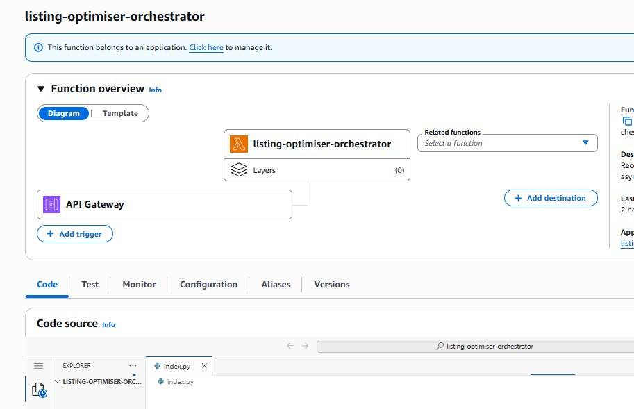
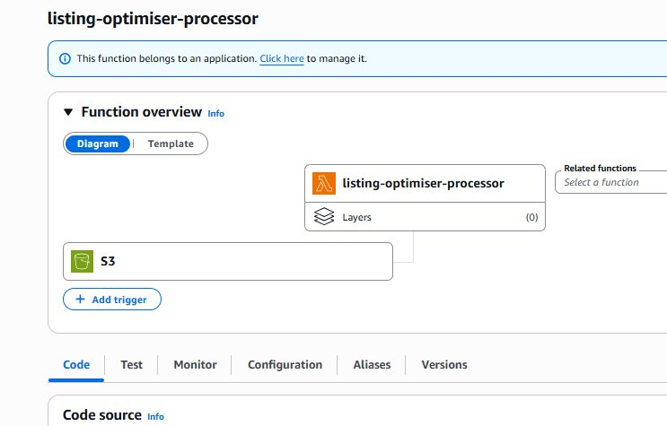
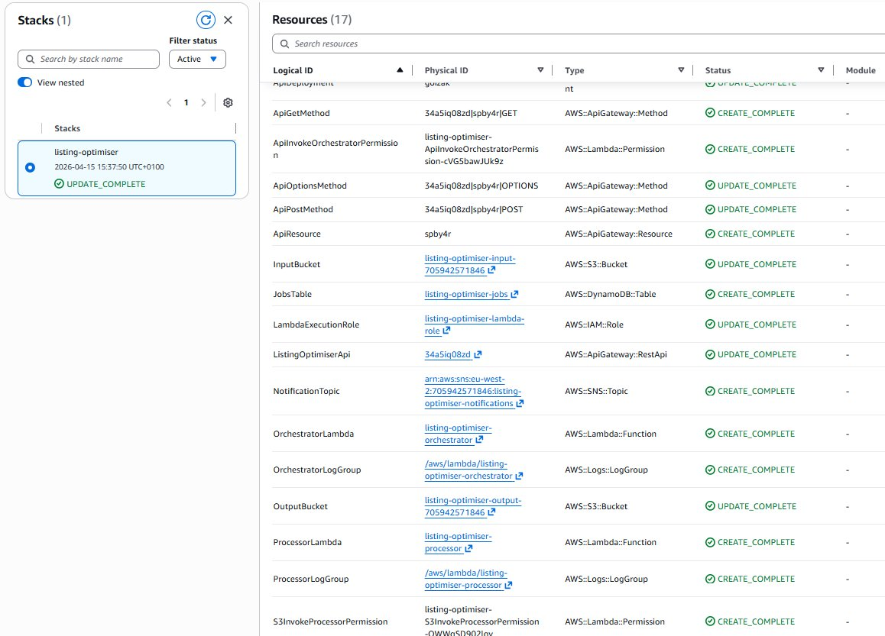
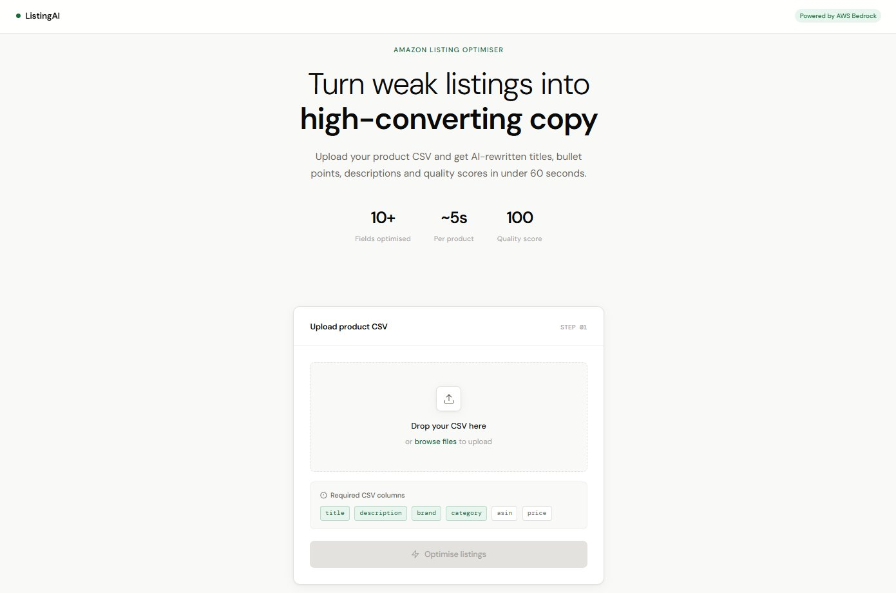
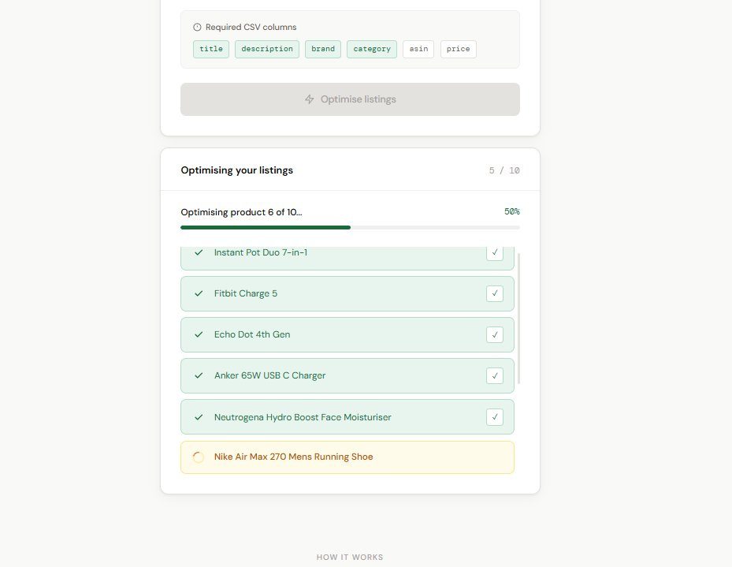
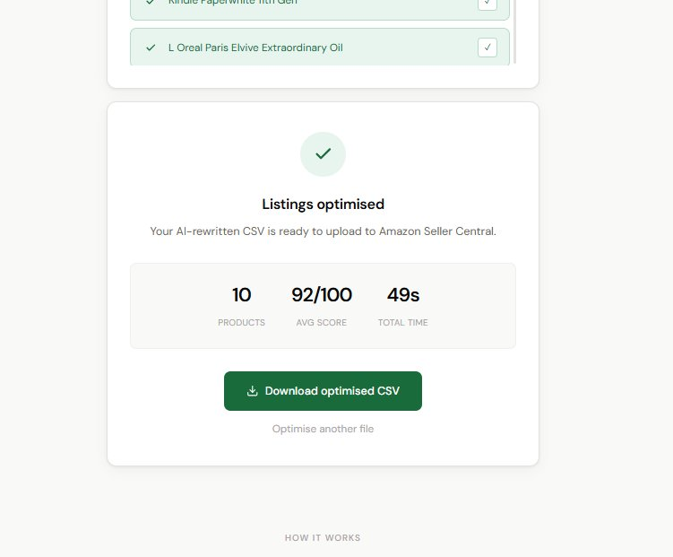
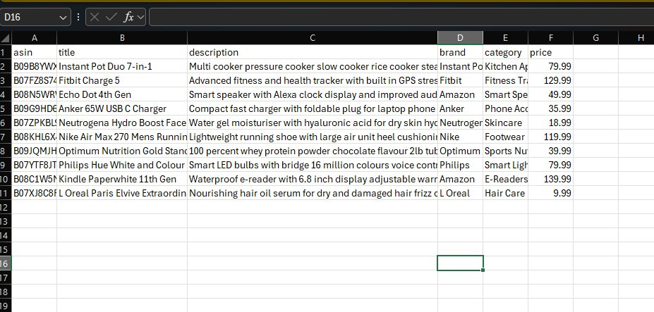
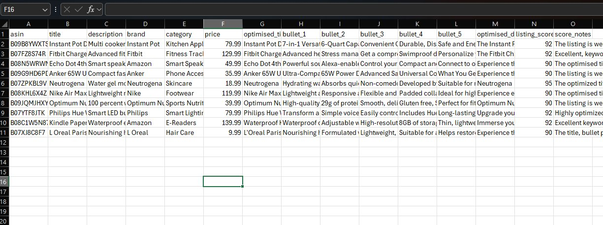

# Deployment Guide — AI-Powered Product Listing Optimiser

---

## Prerequisites

- AWS account (free tier works)
- AWS CLI installed and configured
- Git installed
- GitHub account

---

## Step 1: Set Up AWS CLI

Install AWS CLI from aws.amazon.com/cli then configure:

```bash
aws configure
# Enter: Access Key ID, Secret Access Key, Region (eu-west-2), Output (json)
```

Verify it works:

```bash
aws sts get-caller-identity
```

You should see your Account ID and ARN.

---

## Step 2: Clone the Repo

```bash
git clone https://github.com/Sheldon-desouza/ai-product-listing-optimiser.git
cd ai-product-listing-optimiser
```

Or in AWS CloudShell:

```bash
curl -o template.yaml https://raw.githubusercontent.com/Sheldon-desouza/\
ai-product-listing-optimiser/main/full-version/template.yaml
```

---

## Step 3: Deploy CloudFormation Stack

This deploys all 17 AWS resources in one command:

```bash
aws cloudformation deploy \
  --template-file full-version/template.yaml \
  --stack-name listing-optimiser \
  --parameter-overrides \
      ProjectName=listing-optimiser \
      NotificationEmail=your-email@example.com \
      BedrockModelId=anthropic.claude-3-haiku-20240307-v1:0 \
  --capabilities CAPABILITY_NAMED_IAM \
  --region eu-west-2
```

Takes 2-3 minutes. You should see:

```
Successfully created/updated stack - listing-optimiser
```



---

## Step 4: Fix IAM Marketplace Permissions

Run this after every CloudFormation deploy:

```bash
aws iam put-role-policy \
  --role-name listing-optimiser-lambda-role \
  --policy-name bedrock-marketplace-access \
  --policy-document '{
    "Version": "2012-10-17",
    "Statement": [{
      "Effect": "Allow",
      "Action": [
        "aws-marketplace:ViewSubscriptions",
        "aws-marketplace:Subscribe",
        "bedrock:InvokeModel",
        "bedrock:InvokeModelWithResponseStream"
      ],
      "Resource": "*"
    }]
  }' \
  --region eu-west-2
```

---

## Step 5: Get Your Stack Outputs

```bash
aws cloudformation describe-stacks \
  --stack-name listing-optimiser \
  --query "Stacks[0].Outputs" \
  --output table \
  --region eu-west-2
```

Note down your **ApiEndpoint** URL — you need it for Step 6.


---

## Step 6: Update the Frontend

Open `full-version/index.html` and find:

```javascript
const API_URL = 'YOUR_API_GATEWAY_URL';
```

Replace `YOUR_API_GATEWAY_URL` with the ApiEndpoint from Step 5.

---

## Step 7: Test the Pipeline

Upload the sample CSV to trigger the pipeline:

```bash
# Replace YOUR_ACCOUNT_ID with your AWS account number
aws s3 cp sample-products.csv s3://listing-optimiser-input-YOUR_ACCOUNT_ID/
```

Watch the logs:

```bash
aws logs tail /aws/lambda/listing-optimiser-processor --follow --region eu-west-2
```

Download the output:

```bash
aws s3 ls s3://listing-optimiser-output-YOUR_ACCOUNT_ID/optimised/
aws s3 cp s3://listing-optimiser-output-YOUR_ACCOUNT_ID/optimised/FILENAME.csv .
```

---

## Step 8: Deploy Frontend to AWS Amplify

1. Push your updated `full-version/index.html` to GitHub
2. Go to **AWS Console > Amplify > Create new app**
3. Connect your GitHub repo
4. Select branch: **main**
5. Replace the build spec with:

```yaml
version: 1
frontend:
  phases:
    build:
      commands: []
  artifacts:
    baseDirectory: /full-version
    files:
      - index.html
  cache:
    paths: []
```

6. Click **Save and deploy**

Amplify gives you a live URL in about 2 minutes. Auto-deploys on every GitHub push.

---

## Verify Everything is Running

### Lambda functions




### DynamoDB job tracking table



---

## Live Demo



Upload a CSV and watch each product optimise in real time:



Complete with quality scores and download button:



---

## Before and After

### Raw input data


### AI-optimised output


---

## Monitoring

```bash
# Orchestrator logs
aws logs tail /aws/lambda/listing-optimiser-orchestrator --follow --region eu-west-2

# Processor logs
aws logs tail /aws/lambda/listing-optimiser-processor --follow --region eu-west-2
```

---

## Set a Budget Alert (Recommended)

Protect against unexpected costs:

```bash
aws budgets create-budget \
  --account-id YOUR_ACCOUNT_ID \
  --budget '{
    "BudgetName": "listing-optimiser-alert",
    "BudgetLimit": {"Amount": "10", "Unit": "USD"},
    "TimeUnit": "MONTHLY",
    "BudgetType": "COST"
  }' \
  --notifications-with-subscribers '[{
    "Notification": {
      "NotificationType": "ACTUAL",
      "ComparisonOperator": "GREATER_THAN",
      "Threshold": 80
    },
    "Subscribers": [{
      "SubscriptionType": "EMAIL",
      "Address": "your-email@example.com"
    }]
  }]'
```

---

## Tear Down

```bash
aws s3 rm s3://listing-optimiser-input-YOUR_ACCOUNT_ID --recursive
aws s3 rm s3://listing-optimiser-output-YOUR_ACCOUNT_ID --recursive
aws cloudformation delete-stack --stack-name listing-optimiser --region eu-west-2
```

---

## Common Errors

| Error | Fix |
|---|---|
| AccessDeniedException on Bedrock | Run the IAM marketplace permissions fix in Step 4 |
| 504 Gateway Timeout | Already solved — async architecture handles this |
| ValidationException invalid model | Ensure BedrockModelId is `anthropic.claude-3-haiku-20240307-v1:0` |
| Failed to fetch (CORS) | Redeploy API stage: `aws apigateway create-deployment --rest-api-id YOUR_ID --stage-name prod` |

---

## Author

**Sheldon De Souza** — [LinkedIn](https://www.linkedin.com/in/sheldon-desouza/) · [GitHub](https://github.com/Sheldon-desouza)
