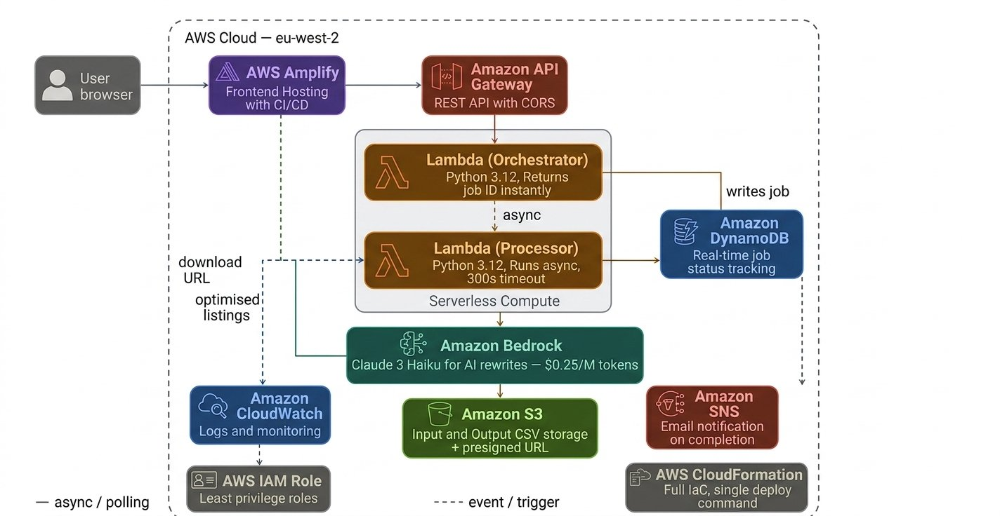

# AI-Powered Product Listing Optimiser

> **Live Demo:** [main.dr87o9j4s7beg.amplifyapp.com](https://main.dr87o9j4s7beg.amplifyapp.com/)

An event-driven, serverless AWS pipeline that automatically rewrites and scores Amazon product listings using generative AI. Upload a raw product CSV, watch each listing optimise in real time, and download a file ready to upload straight to Amazon Seller Central.

Built by [Sheldon De Souza](https://www.linkedin.com/in/sheldon-desouza/) — transitioning from 6 years in eCommerce operations into AWS Cloud and AI Engineering.

---

## Screenshots

### Upload your CSV


### Real-time progress — each product ticks off as Bedrock processes it


### Complete — 10 products, 92/100 average score, 49 seconds


### Before: raw product data


### After: AI-optimised titles, bullet points, descriptions and scores


---

## Architecture



### Why async?

API Gateway has a hard 29-second timeout. Processing 10 products through Bedrock takes 45-60 seconds. The async pattern solves this: the website gets a job ID back in under 1 second, then polls for real-time progress while the Processor Lambda runs in the background with no timeout pressure.

```
Website → POST /optimise → Orchestrator Lambda → creates DynamoDB job → returns job ID (<1s)
Website → GET ?job_id=x  → Orchestrator Lambda → reads DynamoDB → returns % complete
                                                   Processor Lambda → calls Bedrock per product
                                                                    → updates DynamoDB progress
                                                                    → writes output CSV to S3
```

---

## CloudFormation Stack — 17 Resources


---

## Lambda Functions

### Orchestrator — returns job ID instantly


### Processor — runs async, 300 second timeout


---

## DynamoDB — Job Tracking Table


---

## Services Used

| Service | Role |
|---|---|
| Amazon S3 | Input CSV storage, output CSV storage, event trigger |
| AWS Lambda x2 (Python 3.12) | Orchestrator returns job ID instantly; Processor runs async |
| Amazon Bedrock (Claude 3 Haiku) | Rewrites titles, bullets, descriptions and scores each listing |
| Amazon DynamoDB | Tracks job status and real-time progress |
| Amazon API Gateway | REST API with CORS for the website |
| Amazon SNS | Email notification on job completion |
| AWS Amplify | Hosts the live frontend website |
| AWS CloudFormation | Full infrastructure as code, single template deployment |
| AWS IAM | Least privilege roles and policies |
| Amazon CloudWatch | Lambda logs and monitoring |

---

## Repo Structure

```
index.html              ← Demo version (5 products, powers live Amplify site)
full-version/
  index.html            ← Full version (no limit, for self-hosting)
  template.yaml         ← CloudFormation stack
  DEPLOY.md             ← Deployment guide
template.yaml           ← CloudFormation stack
sample-products.csv     ← 10 real products for testing
DEPLOY.md               ← Deployment guide
README.md               ← This file
assets/                 ← Screenshots
```

---

## Deploy Your Own (No Limits)

Use the files in the `full-version/` folder for a self-hosted unlimited version.

### Step 1: Clone the repo

```bash
git clone https://github.com/Sheldon-desouza/ai-product-listing-optimiser.git
cd ai-product-listing-optimiser
```

### Step 2: Deploy the CloudFormation stack

```bash
aws cloudformation deploy \
  --template-file full-version/template.yaml \
  --stack-name listing-optimiser \
  --parameter-overrides \
      ProjectName=listing-optimiser \
      NotificationEmail=your-email@example.com \
      BedrockModelId=anthropic.claude-3-haiku-20240307-v1:0 \
  --capabilities CAPABILITY_NAMED_IAM \
  --region eu-west-2
```

### Step 3: Get your API URL

```bash
aws cloudformation describe-stacks \
  --stack-name listing-optimiser \
  --query "Stacks[0].Outputs[?OutputKey=='ApiEndpoint'].OutputValue" \
  --output text \
  --region eu-west-2
```

### Step 4: Update the frontend

Open `full-version/index.html` and replace `YOUR_API_GATEWAY_URL` with your API URL.

### Step 5: Deploy to Amplify

Push to GitHub and connect your repo to AWS Amplify. Auto-deploys on every push.

See [DEPLOY.md](DEPLOY.md) for the full step-by-step guide including IAM permissions fix.

---

## Input CSV Format

```csv
asin,title,description,brand,category,price
B09B8YWXTS,Instant Pot Duo 7-in-1,Multi cooker...,Instant Pot,Kitchen Appliances,79.99
```

Required: `title`, `description`, `brand`, `category` — Optional: `asin`, `price`

---

## Output CSV Columns Added

| Column | Description |
|---|---|
| `optimised_title` | Keyword-rich title, max 200 chars |
| `bullet_1` to `bullet_5` | Benefit-led bullet points |
| `optimised_description` | Full listing description |
| `listing_score` | Quality score out of 100 |
| `score_notes` | AI improvement notes |

---

## Cost Estimate (10 products)

| Service | Cost |
|---|---|
| Lambda, DynamoDB, SNS, API Gateway | ~$0.00 (free tier) |
| S3 | ~$0.01 |
| Bedrock Claude 3 Haiku | ~$0.05–$0.20 |
| **Total** | **Under $0.25** |

> Claude 3 Haiku at $0.25/M tokens is 12x cheaper than Claude 3 Sonnet and perfectly capable for structured copywriting tasks.

---

## Tear Down

```bash
aws s3 rm s3://listing-optimiser-input-YOUR_ACCOUNT_ID --recursive
aws s3 rm s3://listing-optimiser-output-YOUR_ACCOUNT_ID --recursive
aws cloudformation delete-stack --stack-name listing-optimiser
```

---

## Roadmap

- [x] Async architecture with DynamoDB job tracking
- [x] Real-time progress bar with per-product updates
- [x] Live website on AWS Amplify
- [x] Demo version with 5-product limit and sample data
- [ ] Amazon Rekognition to score product images
- [ ] Multi-marketplace mode (Amazon, Shopify, eBay)
- [ ] RAG pipeline using brand guidelines as context
- [ ] LLM evaluation dashboard

---

## About

Built as part of the AWS re/Start Cloud Engineering Programme (Cohort GBLON18).

**Skills demonstrated:** Async serverless architecture, CloudFormation IaC, Lambda (Python), Amazon Bedrock, DynamoDB, API Gateway, AWS Amplify, IAM least privilege, CloudWatch observability.

---

## Author

**Sheldon De Souza** — AWS Cloud & AI Engineer (in Training) | eCommerce Technology Specialist

[LinkedIn](https://www.linkedin.com/in/sheldon-desouza/) · [GitHub](https://github.com/Sheldon-desouza) · [Live Demo](https://main.dr87o9j4s7beg.amplifyapp.com/)
